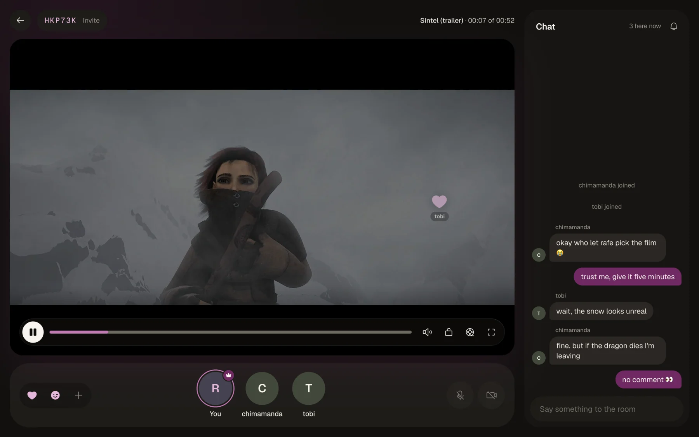
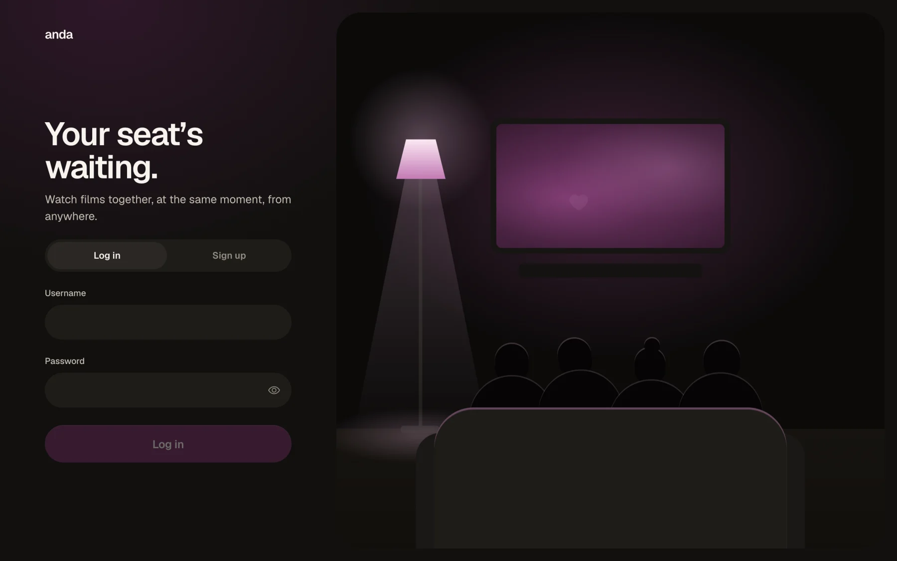
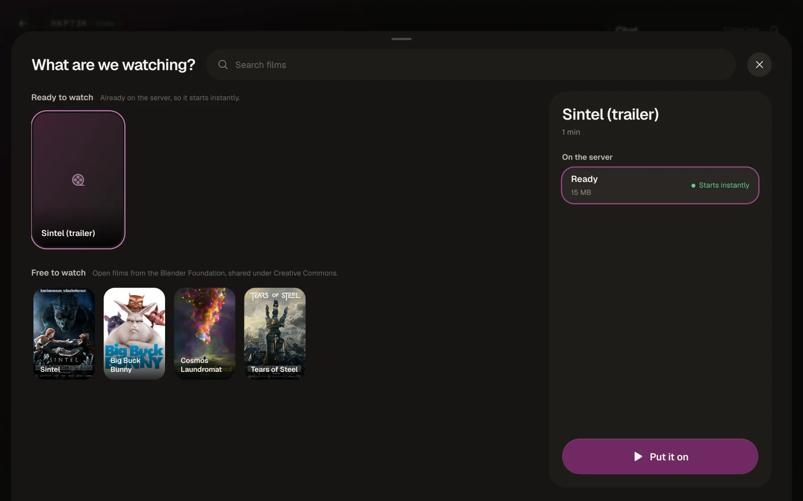
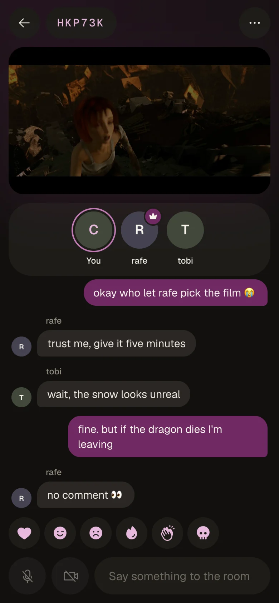
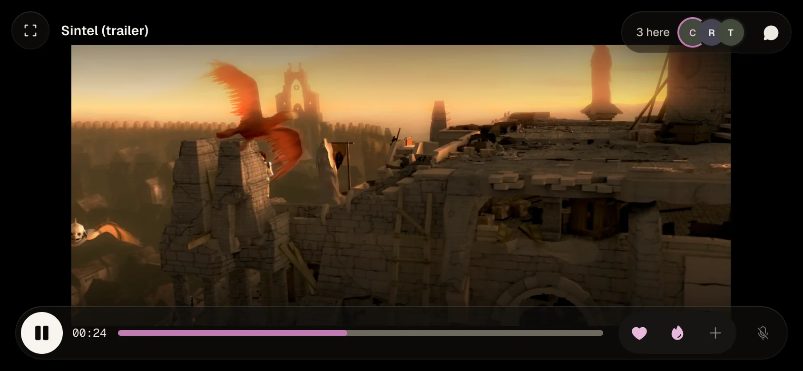

# Anda

Watch films with friends, at the same moment, from anywhere. Start a room, send the code, pick a film, and everyone's player stays in sync while you chat, react and talk.



## What it does

- **Rooms.** Six-letter codes and invite links. An invite link shows who's in the room before you sign in.
- **Synced playback.** The host plays, pauses and seeks for everyone. If one person is buffering, the room waits for them, or the host can choose not to wait. Hosting can be handed to someone else.
- **Chat and reactions.** Messages, typing indicators, and six reactions that float over the film.
- **Voice and camera.** Talk while you watch, through a LiveKit server. Camera tiles sit on the couch next to everyone's seat.
- **A Library to pick from.** Films already on the server start instantly. You can also search a catalog (Cinemeta) and start a film downloading; the room can watch it while it arrives.
- **Your own files.** Drop H.264 films into the media folder. They're picked up and repackaged for streaming automatically.
- **Audio and subtitles.** Every audio track and text subtitle is kept. Each viewer chooses their own language and subtitles, and can nudge the subtitle timing.
- **Fast starts on slow connections.** Heavy films also get a 480p version. The player starts on it and climbs to full quality as the connection allows.
- **Made for phones too.** Portrait shows the film, the couch and the chat. Turn the phone on its side and the film fills the screen, with the chat in a drawer.
- **Little touches.** "Still watching?" after hours of idling. Playback pauses when everyone has stepped away, and rooms remember their film and position.

## Screenshots

| Signed out | Picking a film |
|---|---|
|  |  |

| On a phone | On its side |
|---|---|
|  |  |

## How it works

- **`server/`** is a Go API:
  - Standard `net/http`, with SQLite through `modernc.org/sqlite`. Migrations are embedded with goose, and passwords are hashed with argon2id.
  - WebSockets use `coder/websocket`. Each room runs in its own goroutine, which owns that room's playback state.
  - It also serves the web app.
- **`web/`** is a Next.js app, exported as static files. hls.js plays the films (Safari plays HLS natively).
- **Films** are repackaged into HLS with ffmpeg. Video is copied as it is, and audio is converted to AAC only when it needs to be.
- **Library downloads** go through Stremio's streaming server (the `stremio/server` image). ffmpeg packages the film as it downloads, into a playlist that grows, so a room can start watching early. Finished films become a cache: once it passes its size limit, the films watched least recently are removed.
- **Voice and camera** use [LiveKit](https://livekit.io). The API only issues tokens to people in the room; browsers connect to LiveKit directly.

## Running it locally

You need Go 1.27+, Node 20+, and `ffmpeg` and `ffprobe` on your `PATH`.

```bash
# The API, on :8080. Put an H.264 .mp4 or .mkv in the media folder.
cd server
ANDA_WS_ORIGINS=localhost:3000 ANDA_MEDIA=~/Movies/anda go run ./cmd/anda

# The web app, on :3000. In another terminal; it forwards /api to :8080.
cd web
npm install
npm run dev
```

Open http://localhost:3000 and sign up.

To try it with two people, open a second window on http://127.0.0.1:3000. It keeps its own sign-in, separate from `localhost`. Add `127.0.0.1:3000` to `ANDA_WS_ORIGINS`, and keep both windows visible, because browsers pause video in hidden tabs.

Optional extras:

- **Library downloads:** run Stremio's streaming server (port 11470) and set `ANDA_TORRENT_URL=http://localhost:11470`.
- **Voice and camera:** run a LiveKit server with `deploy/livekit.yaml`, and set `ANDA_LIVEKIT_URL=ws://localhost:7880`, `ANDA_LIVEKIT_KEY` and `ANDA_LIVEKIT_SECRET`.

Tests: `go test ./...` in `server/`, and `npm run typecheck` in `web/`.

## Configuration

The API reads its settings from environment variables:

| Variable | Default | What it does |
|---|---|---|
| `ANDA_ADDR` | `:8080` | Address to listen on |
| `ANDA_DB` | `anda.db` | SQLite file. The media and HLS folders default to sit next to it |
| `ANDA_MEDIA` | `<db dir>/media` | Your own films. Rescanned every 5 minutes |
| `ANDA_HLS` | `<db dir>/hls` | Where films are kept once repackaged for streaming |
| `ANDA_WEB` | `/srv/web` | The built web app (`web/out`), served at `/` |
| `ANDA_WS_ORIGINS` | none | Extra origins allowed to open the WebSocket, e.g. `localhost:3000` |
| `ANDA_SECURE_COOKIE` | `false` | Mark session cookies `Secure`. Turn it on behind HTTPS |
| `ANDA_TRUST_PROXY` | `false` | Take the client IP from `X-Forwarded-For`. Only behind a proxy you control |
| `ANDA_CACHE_GB` | `10` | Size limit for finished Library films. The films watched least recently go first, never one a room is showing |
| `ANDA_TORRENT_URL` | none | Stremio's streaming server. Without it, the Library offers only films already on the server |
| `ANDA_CATALOG_ADDON` | Cinemeta | Stremio catalog addon used for search |
| `ANDA_STREAM_ADDONS` | none | Extra Stremio stream addons (comma-separated base URLs) |
| `ANDA_SUBTITLE_ADDONS` | none | Stremio subtitle addons (comma-separated base URLs) |
| `ANDA_LIVEKIT_URL`, `_KEY`, `_SECRET` | none | LiveKit for voice and camera. A relative URL like `/livekit` is completed with the page's host |
| `ANDA_LOW_RUNG` | on | `off` stops making the background 480p versions |
| `ANDA_IDLE_AFTER` | `3h` | How long before "Still watching?" appears (e.g. `40s` for testing) |

## Deploying

`docker-compose.yml` runs three containers:

| Container | Image | What it does |
|---|---|---|
| `anda-api` | Alpine with ffmpeg | The API, which also serves the web app |
| `torrent` | `stremio/server` | Library downloads |
| `livekit` | `livekit/livekit-server` | Voice and camera |

`deploy.sh` builds everything on your machine: the Go binary is cross-compiled for linux/amd64, and the web app is exported. It then copies the result to the server with rsync and runs `docker compose up`. The server only needs Docker. Set `HOST` and `KEY` to point it at your own server.

What the setup expects:

- **A reverse proxy in front.** Anda's containers don't publish ports for HTTP. They join an external Docker network called `edge`, where a reverse proxy (Caddy, in our case) reaches them. Route `/livekit/*` to `anda-livekit:7880` with the prefix removed, and everything else to `anda-api:8080`.
- **LiveKit's media ports open.** LiveKit is the one container that publishes ports, because WebRTC media can't go through the proxy: UDP 7882, TCP 7881 and UDP 3478. Open them in the server's firewall.
- **Secrets on the server.** On its first run, `deploy.sh` generates LiveKit's key and secret into `.env` on the server. That file is never synced or committed.
- **Optional: data on its own disk.** `deploy/disk.yml` keeps the database and films on a separately mounted disk. To use it, set `COMPOSE_FILE=docker-compose.yml:deploy/disk.yml` in the server's `.env`.

## Where films come from

Anda comes with one source: the Blender Foundation's open films (*Sintel*, *Big Buck Bunny*, *Cosmos Laundromat*), shared under Creative Commons. You can also add your own files to the media folder, or point `ANDA_STREAM_ADDONS` at Stremio addons. Only use sources you have the right to stream.

## Credits

The screenshots show the [*Sintel*](https://durian.blender.org) trailer, © Blender Foundation, licensed under [CC BY 3.0](https://creativecommons.org/licenses/by/3.0/).

## License

[MIT](LICENSE). The screenshots' film is Blender's, under its own CC BY 3.0 license (see Credits).
